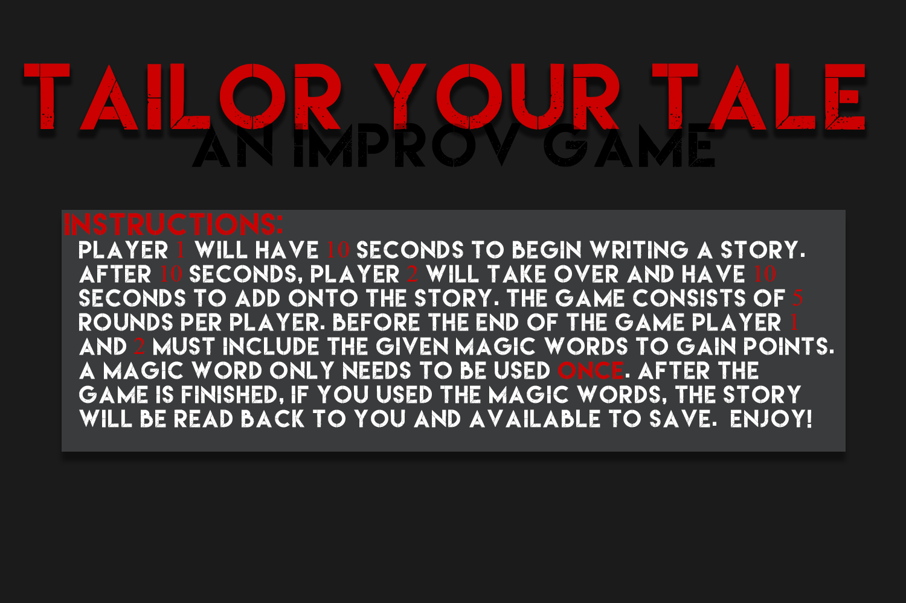

# Taylor-Your-Tale
An improvisational video game where two players must collaboratively make a story

## How to Run:
This project can only be run on Windows OS. To run this file, either download the 64 bit or 32 bit version project and simply click on the exe file. This project will take about 10-15 seconds to load normally.

## How to Play:
### Controls:
To control this game, just type on your keyboard like you normally would type 

### Rules:
1)	Start the game by pressing player and having two players 
2)	Player 1 starts with the computer 
3)	Player 1 will have 10 seconds to start typing a story
4)	After 10 seconds, a bell sound will play, and Player 1 has three seconds to pass the computer to Player 2
5)	Player 2 has 10 seconds to type and continue the story
6)	Repeat 2-5 a total of five times
7)	There are 3 “magic words” displayed on the left side of the screen players must include in their story 
8)	If all magic words are used, the players can hear and save their story

## In Game Image

## Credits:
### Processing (https://processing.org/)
Processing is a Java based data visualization tool used to create this project.
### Emily Polanco 
Did all the visual design aspects of the game
### Jeremiah Dir 
Wrote some of the code for the game
